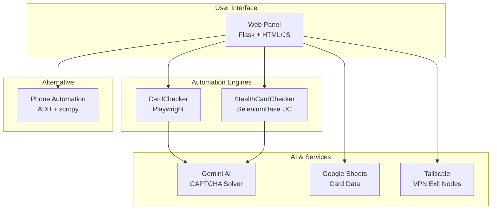

# Card Balance Checker & Browser Automation

A multi-platform automation system for checking gift card balances with advanced anti-detection capabilities and AI-powered CAPTCHA solving.

## Features

- **Multi-Browser Support** - Playwright & SeleniumBase for maximum compatibility
- **Anti-Detection** - Stealth browser mode bypasses Cloudflare and anti-bot systems
- **AI CAPTCHA Solving** - Gemini AI integration for reCAPTCHA challenges
- **Google Sheets Integration** - Batch process cards from spreadsheets
- **VPN/Exit Node Rotation** - Tailscale integration for IP management
- **Phone Automation** - Android device control via ADB as alternative approach
- **Real-time Monitoring** - Live logs and status updates via web panel

## System Architecture



## Quick Start

### Using UV (Recommended)

```bash
# Install UV
curl -LsSf https://astral.sh/uv/install.sh | sh

# Run the application
uv run app.py
```

Open **http://127.0.0.1:5000** in your browser.

### Manual Installation

```bash
# Create virtual environment
python -m venv venv
source venv/bin/activate

# Install dependencies
pip install -r requirements.txt

# Install Playwright browsers
playwright install chromium

# Run
python app.py
```

## Documentation

| Document | Description |
|----------|-------------|
| [Architecture](docs/ARCHITECTURE.md) | System design with mermaid diagrams |
| [Setup Guide](docs/SETUP_GUIDE.md) | Installation and configuration |
| [API Reference](docs/API_REFERENCE.md) | REST API endpoints |
| [Development Journey](docs/DEVELOPMENT_JOURNEY.md) | Lessons learned and best practices |

## Project Structure

```
cursor/
├── app.py                    # Main Flask web application
├── card_checker.py           # Playwright-based automation
├── stealth_browser.py        # SeleniumBase anti-detection wrapper
├── stealth_card_checker.py   # Card checker with stealth browser
├── sheets_manager.py         # Google Sheets integration
├── settings.json             # Application settings
│
├── prompts/                  # AI CAPTCHA prompts
│   ├── detailed.md           # Full grid explanation
│   ├── simple.md             # Minimal instructions
│   ├── visual.md             # Coordinate-based
│   └── expert.md             # Technical precision
│
├── phone/                    # Phone automation module
│   ├── main.py               # CLI entry point
│   ├── web_app.py            # Web interface (port 5001)
│   ├── adb_controller.py     # ADB commands
│   └── ...
│
├── templates/                # Web UI templates
├── static/                   # CSS and assets
├── docs/                     # Documentation
│
├── pyproject.toml            # UV/pip configuration
└── requirements.txt          # Dependencies
```

## Configuration

### Settings (settings.json)

```json
{
  "browser": "stealth",
  "captcha_mode": "gemini",
  "max_retries": 5,
  "always_use_exit_node": true,
  "gemini_api_keys": ["key1", "key2"],
  "gemini_model": "gemini-2.5-flash",
  "gemini_prompt_preset": "expert"
}
```

### Browser Options

| Browser | Description | Use Case |
|---------|-------------|----------|
| `chromium` | Standard Playwright | Fast, most compatible |
| `stealth` | SeleniumBase UC Mode | Anti-detection required |
| `firefox` | Firefox browser | Alternative fingerprint |
| `chrome` | System Chrome | Existing profiles |

### CAPTCHA Modes

| Mode | Description |
|------|-------------|
| `auto` | Try exit node rotation first |
| `gemini` | Use Gemini AI solver |
| `manual` | Wait for user to solve |

## Phone Automation

Alternative approach using real Android devices:

```bash
# Connect phone via USB
adb devices

# Run phone web app
uv run phone/web_app.py
```

Open **http://127.0.0.1:5001** for phone control panel.

## API Usage

### Check Card Balance

```bash
curl -X POST http://127.0.0.1:5000/check_balance \
  -H "Content-Type: application/json" \
  -d '{
    "card_number": "4111111111111111",
    "exp_month": "12",
    "exp_year": "25",
    "cvv": "123"
  }'
```

### Get Sheet Cards

```bash
curl http://127.0.0.1:5000/sheets/cards
```

### Switch Exit Node

```bash
curl -X POST http://127.0.0.1:5000/exit_nodes/switch \
  -H "Content-Type: application/json" \
  -d '{"hostname": "us-west-2.tailscale.com"}'
```

See [API Reference](docs/API_REFERENCE.md) for complete documentation.

## Development

### Running in Development Mode

```bash
# With auto-reload
FLASK_DEBUG=1 uv run app.py
```

### Running Tests

```bash
uv run pytest
```

### Code Formatting

```bash
uv run black .
uv run ruff check .
```

## Troubleshooting

### Browser Won't Start

```bash
# Kill zombie processes
pkill -9 -f chromedriver
pkill -9 -f chromium

# Reinstall browsers
playwright install chromium --force
```

### CAPTCHA Not Solving

1. Verify Gemini API key is valid
2. Try different prompt preset
3. Check `gemini_debug_save: true` for debug images

### Phone Not Detected

```bash
adb kill-server
adb start-server
adb devices
```

See [Setup Guide](docs/SETUP_GUIDE.md) for more troubleshooting tips.

## Requirements

- Python 3.10+
- Chromium/Chrome browser
- ADB (for phone automation)
- Tailscale (for exit nodes, optional)

## License

MIT License

## Contributing

1. Fork the repository
2. Create feature branch (`git checkout -b feature/amazing`)
3. Commit changes (`git commit -m 'Add amazing feature'`)
4. Push to branch (`git push origin feature/amazing`)
5. Open Pull Request
