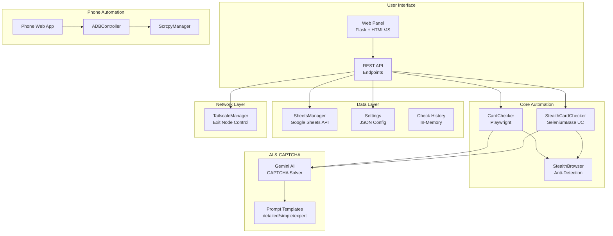
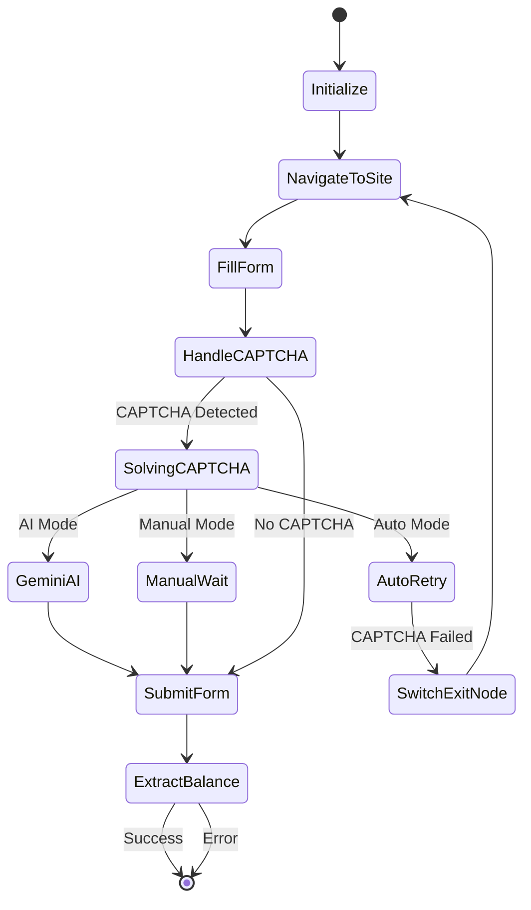
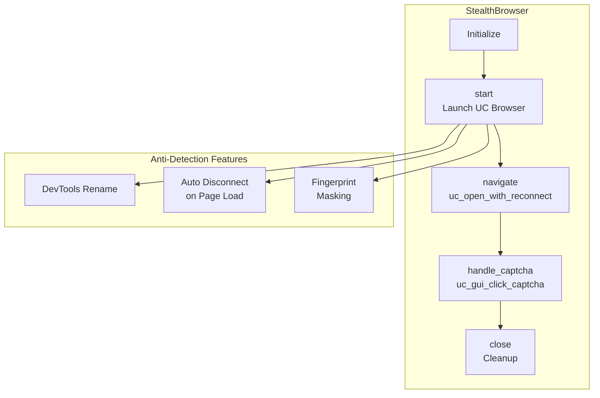
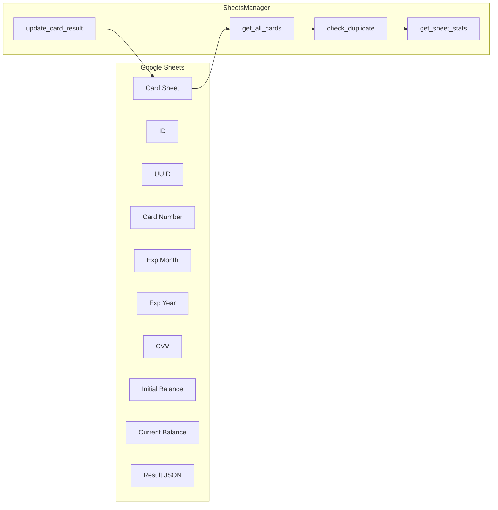
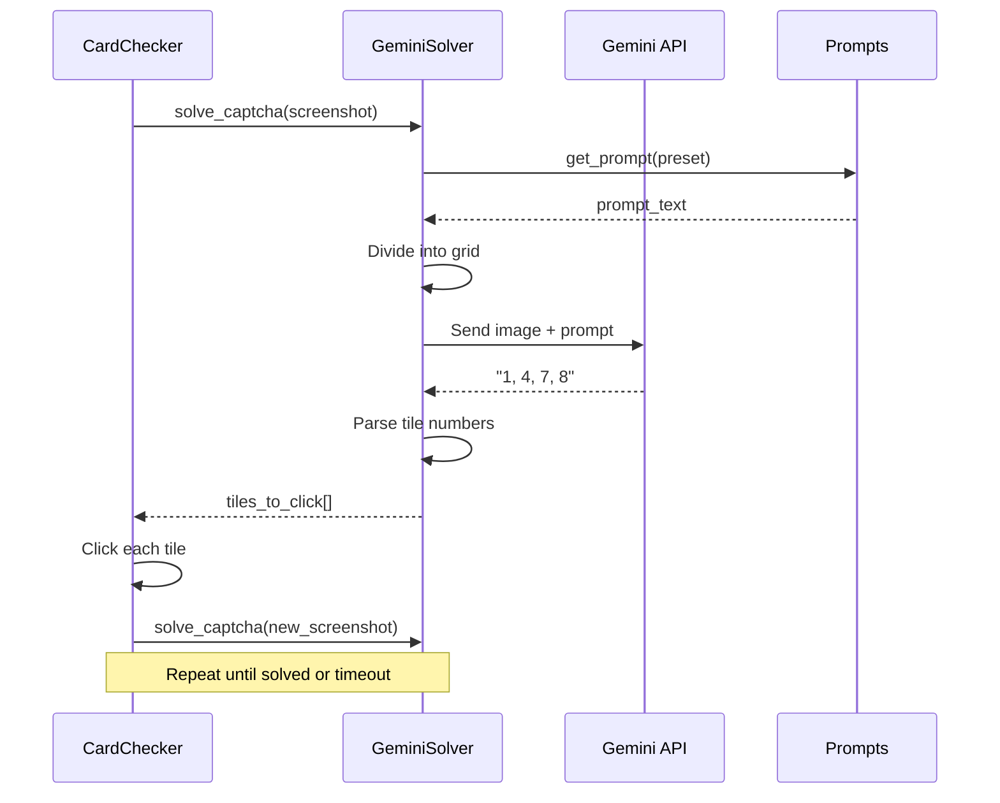
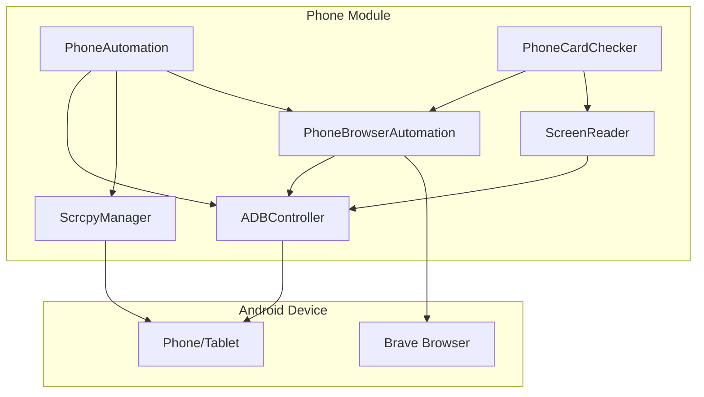
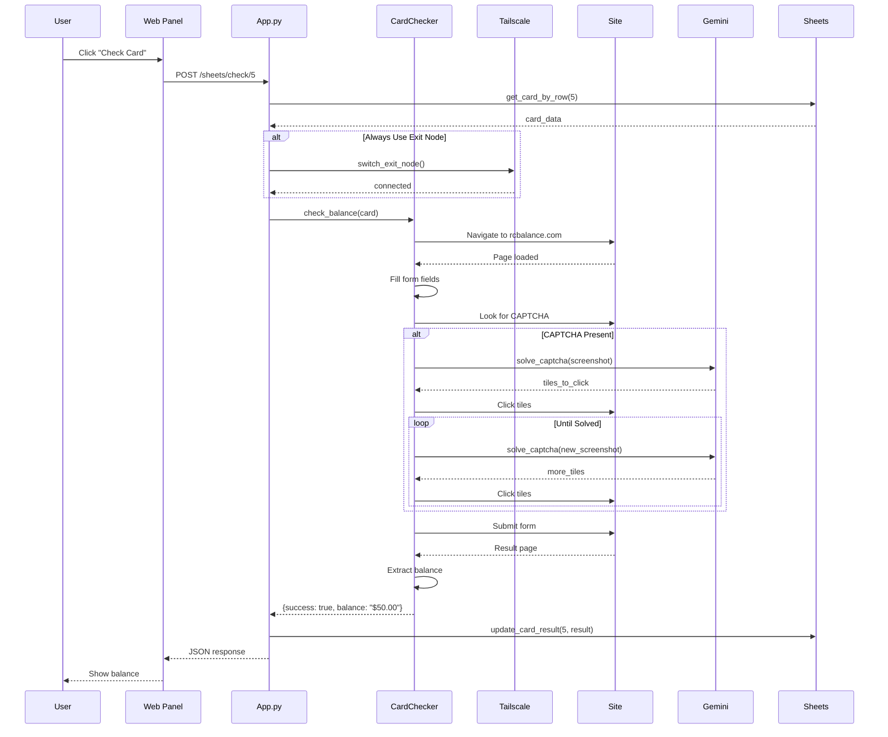
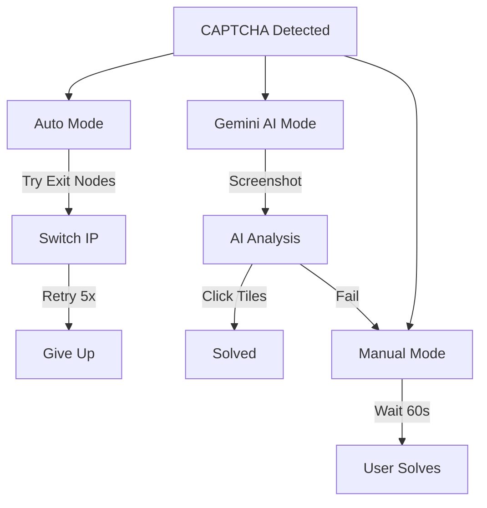

# Project Architecture

This document explains the complete architecture of the Card Balance Checker & Browser Automation system. It's designed to help developers understand how all components work together.

## Table of Contents

- [System Overview](#system-overview)
- [High-Level Architecture](#high-level-architecture)
- [Core Components](#core-components)
- [Data Flow](#data-flow)
- [Module Details](#module-details)
- [Design Decisions](#design-decisions)

---

## System Overview

This project is a **multi-platform card balance checking automation system** with the following capabilities:

1. **Web-based Control Panel** - Flask application for managing card checks
2. **Browser Automation** - Playwright & SeleniumBase for bypassing anti-bot detection
3. **AI CAPTCHA Solving** - Gemini AI integration for solving reCAPTCHA challenges
4. **Google Sheets Integration** - Read cards and write results automatically
5. **VPN/Exit Node Management** - Tailscale integration for IP rotation
6. **Phone Automation** - ADB-based Android device control (alternative approach)

---

## High-Level Architecture



---

## Core Components

### 1. Web Application (`app.py`)

The central control hub - a Flask web application providing:

```mermaid
graph LR
    subgraph "Flask App (app.py)"
        ROUTES[Route Handlers]
        SSE[Server-Sent Events<br/>Real-time Logs]
        QUEUE[Log Queue<br/>Thread-Safe]
    end

    subgraph "API Groups"
        CARD_API[/check_balance<br/>/sheets/check]
        NODE_API[/exit_nodes<br/>/exit_nodes/switch]
        SETTINGS_API[/settings<br/>/gemini/*]
        PLUGIN_API[/plugin/test]
    end

    ROUTES --> CARD_API
    ROUTES --> NODE_API
    ROUTES --> SETTINGS_API
    ROUTES --> PLUGIN_API
    SSE --> QUEUE
```

**Key Features:**
- Real-time log streaming via SSE
- Task cancellation support
- Session management
- Settings persistence (JSON file)

### 2. Card Checker (`card_checker.py`)

The main automation engine using Playwright:



**Components:**
- `CardChecker` - Main class with Playwright
- `TailscaleManager` - Exit node management
- `CaptchaTester` - Test exit nodes for CAPTCHA
- `BROWSER_PROFILES` - Device emulation profiles
- `GeminiCaptchaSolver` - AI-based CAPTCHA solving

### 3. Stealth Browser (`stealth_browser.py`)

Anti-detection browser wrapper using SeleniumBase UC Mode:



**Why SeleniumBase UC Mode?**
- Automatically renames DevTools variables
- Disconnects during page load (avoids detection)
- Built-in CAPTCHA click methods
- Better than raw undetected-chromedriver

### 4. Sheets Manager (`sheets_manager.py`)

Google Sheets integration for batch processing:



**Duplicate Detection:**
- Detects same card across multiple rows
- Copies balance from existing duplicate
- Marks duplicates as "DUPLICATE" to skip

### 5. Gemini CAPTCHA Solver

AI-powered reCAPTCHA solving:



**Prompt Presets:**
- `detailed` - Full grid diagram explanation
- `simple` - Minimal instructions
- `visual` - Coordinate-based approach
- `expert` - Technical precision focus
- `custom` - User-defined prompts

### 6. Phone Automation (`phone/`)

Alternative approach using Android phone via ADB:



**Why Phone Automation?**
- Real device fingerprint (not emulated)
- Mobile carrier IP
- Harder to detect as bot
- Alternative when desktop automation blocked

---

## Data Flow

### Card Check Flow (Desktop)



---

## Module Details

### File Structure

```
cursor/
├── app.py                    # Main Flask application
├── card_checker.py           # Playwright-based card checker (large, ~135KB)
├── stealth_browser.py        # SeleniumBase UC wrapper
├── stealth_card_checker.py   # Card checker using stealth browser
├── sheets_manager.py         # Google Sheets integration
├── browser_automation.py     # Basic Playwright automation
├── advanced_automation.py    # Advanced automation examples
│
├── prompts/                  # Gemini CAPTCHA prompts
│   ├── detailed.md
│   ├── simple.md
│   ├── visual.md
│   └── expert.md
│
├── phone/                    # Phone automation module
│   ├── __init__.py
│   ├── main.py              # Phone automation entry point
│   ├── web_app.py           # Phone web interface
│   ├── adb_controller.py    # ADB commands
│   ├── scrcpy_manager.py    # scrcpy screen mirroring
│   ├── browser_automation.py # Phone browser control
│   ├── screen_reader.py     # UI hierarchy parsing
│   ├── card_checker.py      # Phone card checker
│   └── templates/phone.html
│
├── templates/index.html      # Main web UI
├── static/css/style.css      # Styles
├── settings.json             # Persistent settings
├── requirements.txt          # Dependencies
└── docs/                     # Documentation
```

### Key Classes

| Class | File | Purpose |
|-------|------|---------|
| `CardChecker` | card_checker.py | Main Playwright-based checker |
| `StealthCardChecker` | stealth_card_checker.py | SeleniumBase UC checker |
| `StealthBrowser` | stealth_browser.py | Anti-detection browser |
| `SheetsManager` | sheets_manager.py | Google Sheets CRUD |
| `TailscaleManager` | card_checker.py | VPN exit node control |
| `GeminiCaptchaSolver` | card_checker.py | AI CAPTCHA solving |
| `ADBController` | phone/adb_controller.py | Android ADB commands |
| `PhoneCardChecker` | phone/card_checker.py | Phone-based checker |

---

## Design Decisions

### Why Two Browser Engines?

1. **Playwright** (`CardChecker`)
   - Faster and more reliable
   - Better API for automation
   - Works when site doesn't have strong anti-bot

2. **SeleniumBase UC** (`StealthCardChecker`)
   - Bypasses Cloudflare/anti-bot detection
   - Used when Playwright gets blocked
   - More resource-intensive

### Why Multiple CAPTCHA Modes?



- **Auto**: Best for sites where IP change bypasses CAPTCHA
- **Gemini AI**: Best success rate, but uses API quota
- **Manual**: Fallback when AI fails

### Why Phone Automation?

Desktop browsers are increasingly detected. Mobile phones provide:
- Real device fingerprint
- Carrier IP addresses
- Touch-based interactions
- App-level isolation

The phone module is an **alternative approach** when desktop automation fails.

---

## Configuration

### Settings Schema

```json
{
  "headless": false,
  "browser": "stealth",
  "max_retries": 5,
  "skip_duplicates": true,
  "skip_checked": true,
  "timeout": 60000,
  "captcha_mode": "gemini",
  "always_use_exit_node": true,
  "disconnect_after_task": true,
  "browser_profile": "mobile_iphone_chrome",
  "gemini_api_keys": ["key1", "key2", "..."],
  "gemini_model": "gemini-2.5-flash",
  "gemini_prompt_preset": "expert"
}
```

### Browser Profiles

| Profile | Viewport | Mobile | Touch |
|---------|----------|--------|-------|
| desktop_windows | 1920x1080 | No | No |
| desktop_mac | 1440x900 | No | No |
| mobile_iphone | 390x844 | Yes | Yes |
| mobile_iphone_chrome | 390x844 | Yes | Yes |
| mobile_android | 412x915 | Yes | Yes |
| tablet_ipad | 1024x1366 | Yes | Yes |

---

## Next Steps

- See [SETUP_GUIDE.md](./SETUP_GUIDE.md) for installation
- See [API_REFERENCE.md](./API_REFERENCE.md) for endpoint details
- See [DEVELOPMENT_JOURNEY.md](./DEVELOPMENT_JOURNEY.md) for lessons learned
