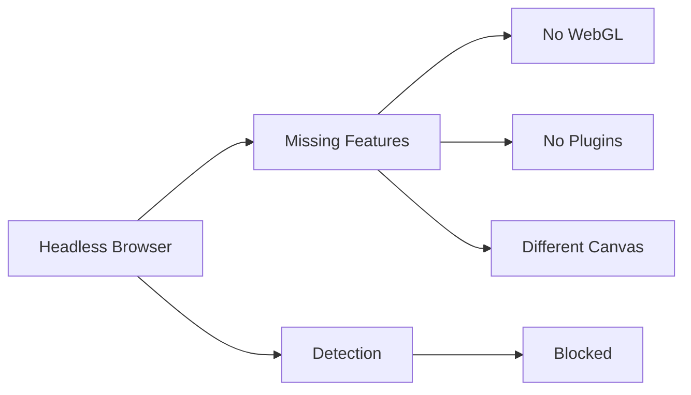
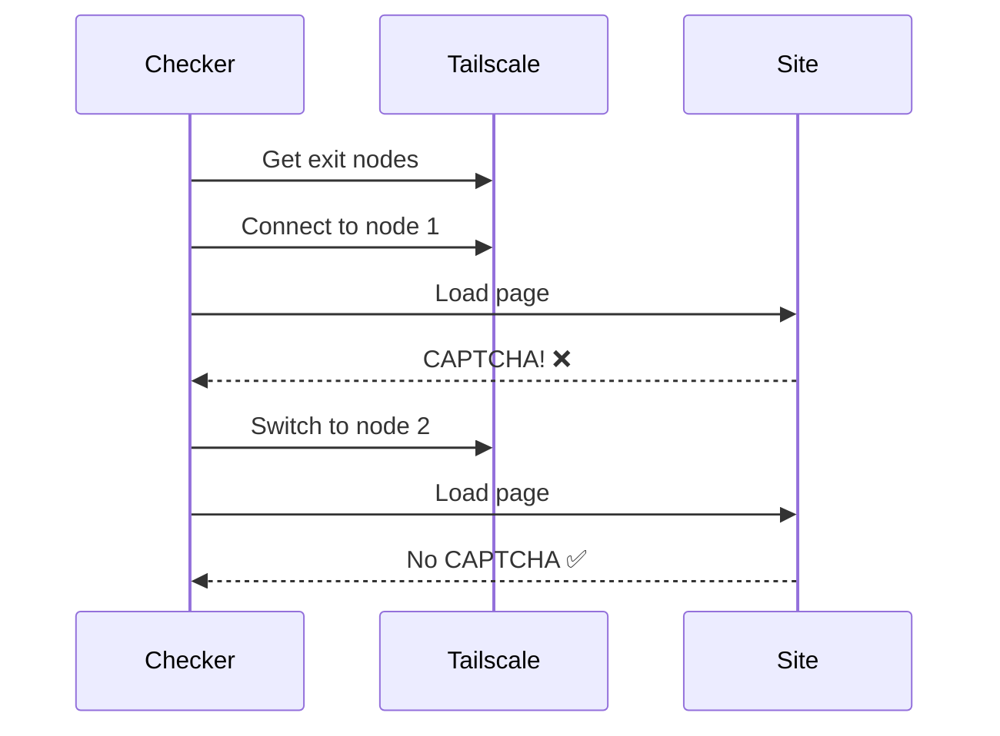
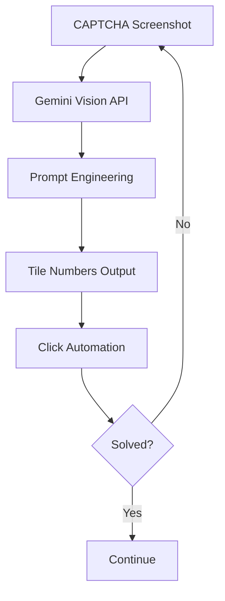
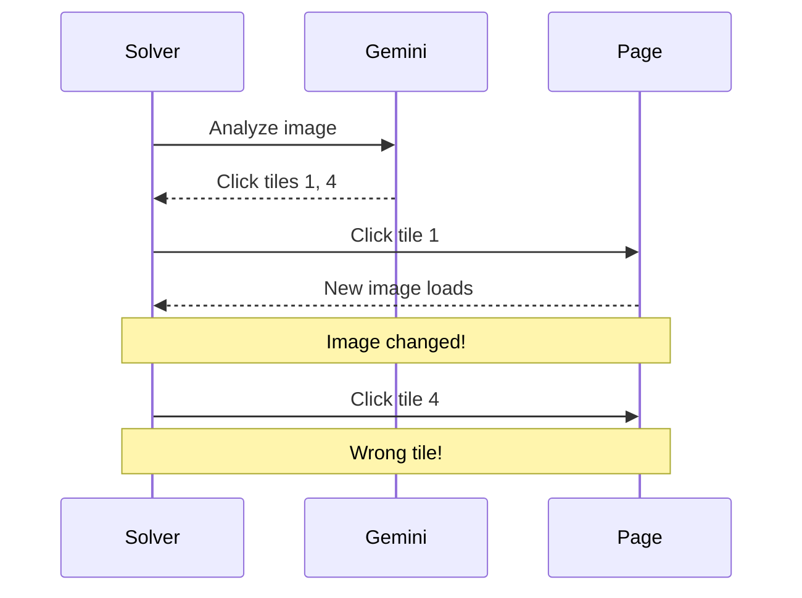
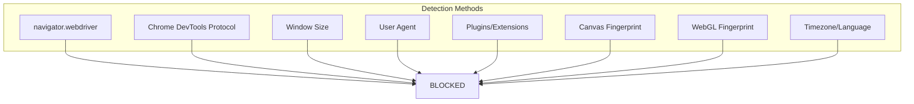
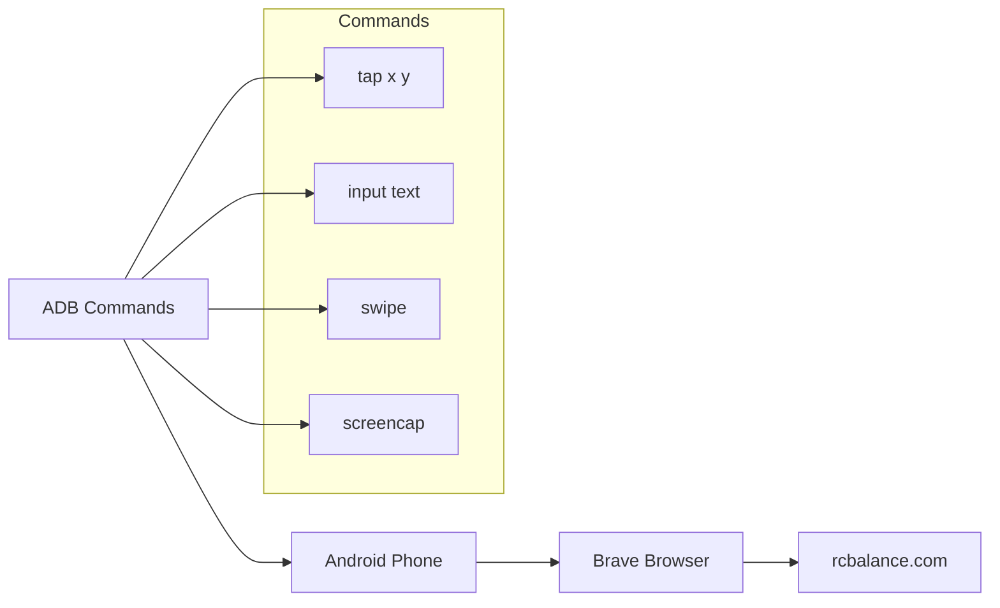

# Development Journey

This document captures the lessons learned, trial and error experiences, and key insights discovered during the development of this automation system.

## Table of Contents

- [Browser Automation Challenges](#browser-automation-challenges)
- [CAPTCHA Solving Evolution](#captcha-solving-evolution)
- [Anti-Detection Techniques](#anti-detection-techniques)
- [Phone Automation Discovery](#phone-automation-discovery)
- [Performance Optimizations](#performance-optimizations)
- [Common Pitfalls](#common-pitfalls)
- [Best Practices](#best-practices)

---

## Browser Automation Challenges

### Challenge 1: Bot Detection

**Problem:** Sites like rcbalance.com use Cloudflare and other anti-bot systems that detect automated browsers.

**What Didn't Work:**
```python
# Simple Playwright - DETECTED
browser = await playwright.chromium.launch()
# ❌ navigator.webdriver = true
# ❌ Chrome DevTools Protocol detectable
# ❌ Automation fingerprint visible
```

**What Worked:**
```python
# SeleniumBase UC Mode - BYPASSES DETECTION
from seleniumbase import Driver
driver = Driver(uc=True, headless=False)
driver.uc_open_with_reconnect(url, 4)
# ✅ DevTools variables renamed
# ✅ Disconnects during page load
# ✅ Real browser fingerprint
```

**Key Insight:** The `uc_open_with_reconnect()` method is crucial - it disconnects the automation during page load, which is when most bot detection runs.

---

### Challenge 2: Headless vs Headed Mode

**Problem:** Headless browsers are easily detected.



**Solution:** Always prefer headed mode for sensitive sites:

```python
# ❌ Bad - easily detected
Driver(uc=True, headless=True)

# ✅ Good - real browser appearance
Driver(uc=True, headless=False)

# ✅ Alternative - headless with all features
options.add_argument('--headless=new')  # Chrome's new headless
```

---

### Challenge 3: Browser Profile Management

**Problem:** Chrome/Chromium locks user data directories, causing crashes when reusing profiles.

**Error:**
```
selenium.common.exceptions.InvalidArgumentException: 
Message: user data directory is already in use
```

**Solution:** Use temporary directories with cleanup:

```python
import tempfile
import shutil

# Create fresh temp directory for each session
user_data_dir = tempfile.mkdtemp(prefix='stealth_browser_')

try:
    driver = Driver(uc=True, user_data_dir=user_data_dir)
    # ... do work ...
finally:
    driver.quit()
    shutil.rmtree(user_data_dir, ignore_errors=True)
```

**Lesson:** Always clean up chromedriver processes before starting new sessions:

```python
subprocess.run(['pkill', '-9', '-f', 'chromedriver'], capture_output=True)
time.sleep(0.5)
```

---

## CAPTCHA Solving Evolution

### Phase 1: Exit Node Rotation (Initial Approach)

**Idea:** Different IPs might not trigger CAPTCHA.



**Result:** Works sometimes, but unreliable. Some exit nodes always trigger CAPTCHA.

---

### Phase 2: AI CAPTCHA Solving with YOLO

**Idea:** Use computer vision to solve image CAPTCHAs.

**What Didn't Work:**
- YOLO models need specific training data
- reCAPTCHA images change frequently
- Model accuracy was ~60-70%

---

### Phase 3: Gemini AI (Current Solution)

**Breakthrough:** Large language models with vision can understand CAPTCHA instructions.



**Key Discovery - Prompt Engineering Matters:**

| Prompt Style | Success Rate | Notes |
|--------------|--------------|-------|
| Simple | ~50% | "Find X in tiles" |
| Detailed | ~75% | Full grid explanation |
| Visual | ~70% | Coordinate-based |
| Expert | ~85% | Technical precision |

**The Expert Prompt Works Best Because:**
1. Explicitly defines grid numbering (1-9 or 1-16)
2. Shows visual diagram of grid layout
3. States rules clearly (partial objects count)
4. Gives example output format

---

### Phase 4: Dynamic Re-check (Important!)

**Problem:** First click often changes the CAPTCHA image.



**Solution:** Re-analyze after EACH click:

```python
gemini_settings = {
    'gemini_dynamic_recheck': True  # ← Critical!
}

while not solved:
    screenshot = take_screenshot()
    tiles = gemini.analyze(screenshot)
    if tiles:
        click_tile(tiles[0])  # Click ONE tile
        time.sleep(1)
        # Loop will re-analyze with new screenshot
```

---

## Anti-Detection Techniques

### What Gets Detected



### Working Solutions

**1. SeleniumBase UC Mode (Recommended)**
```python
from seleniumbase import Driver
driver = Driver(uc=True)
```

**2. Browser Profile Emulation**
```python
BROWSER_PROFILES = {
    'mobile_iphone_chrome': {
        'viewport': {'width': 390, 'height': 844},
        'user_agent': 'Mozilla/5.0 (iPhone; CPU iPhone OS 17_0...',
        'is_mobile': True,
        'has_touch': True,
        'device_scale_factor': 3,
        'locale': 'en-US',
        'timezone_id': 'America/New_York'
    }
}
```

**3. Stealth Scripts (Playwright)**
```javascript
// Hide webdriver property
Object.defineProperty(navigator, 'webdriver', {
    get: () => undefined
});

// Override plugins
Object.defineProperty(navigator, 'plugins', {
    get: () => [1, 2, 3, 4, 5]
});
```

**4. Exit Node Rotation**
```python
# Change IP between requests
TailscaleManager.switch_exit_node(hostname)
time.sleep(2)  # Wait for connection
```

---

## Phone Automation Discovery

### Why Phone Automation?

After desktop automation got blocked repeatedly, we discovered that **real mobile devices have different fingerprints** that are harder to detect.

**Desktop vs Phone Detection:**

| Aspect | Desktop Browser | Phone Browser |
|--------|-----------------|---------------|
| Fingerprint | Easily spoofed | Real hardware |
| IP Address | VPN/Exit node | Carrier IP |
| Touch Events | Simulated | Native |
| GPU/Canvas | Different | Mobile-specific |
| Detection Rate | High | Low |

### ADB Automation Approach



**Implementation:**
```python
class ADBController:
    def tap(self, x, y):
        subprocess.run(['adb', 'shell', 'input', 'tap', str(x), str(y)])

    def input_text(self, text):
        escaped = text.replace(' ', '%s')
        subprocess.run(['adb', 'shell', 'input', 'text', escaped])
```

### Screen Reading with UI Hierarchy

```python
# Get UI elements
result = subprocess.run(['adb', 'shell', 'uiautomator', 'dump'])
# Parse /sdcard/window_dump.xml
# Find elements by text/resource-id/class
```

---

## Performance Optimizations

### 1. Parallel Processing

**Problem:** Checking cards one by one is slow.

**Solution:** Use ThreadPoolExecutor for concurrent checks:

```python
from concurrent.futures import ThreadPoolExecutor

def check_batch(cards, max_workers=3):
    with ThreadPoolExecutor(max_workers=max_workers) as executor:
        futures = [executor.submit(check_card, card) for card in cards]
        results = [f.result() for f in futures]
    return results
```

### 2. Screenshot Optimization (Phone)

**Problem:** Full PNG screenshots are slow and large.

**Solution:** Capture directly as JPEG with resize:

```python
# Fast screenshot pipeline
result = subprocess.run(['adb', 'exec-out', 'screencap', '-p'], capture_output=True)
img = Image.open(BytesIO(result.stdout))
img = img.convert('RGB')  # Remove alpha
img = img.resize((img.width * 2 // 5, img.height * 2 // 5))  # 40% size
buffer = BytesIO()
img.save(buffer, format='JPEG', quality=50)  # Compress
```

### 3. API Key Rotation

**Problem:** Gemini API has rate limits per key.

**Solution:** Rotate through multiple keys:

```python
class GeminiKeyTracker:
    def __init__(self):
        self.keys = settings['gemini_api_keys']
        self.current_index = 0
        self.key_stats = {}

    def get_next_key(self):
        key = self.keys[self.current_index]
        self.current_index = (self.current_index + 1) % len(self.keys)
        return key
```

---

## Common Pitfalls

### 1. Zombie Chrome Processes

**Symptom:** "user data directory is already in use"

**Fix:**
```bash
pkill -9 -f chromedriver
pkill -9 -f 'chrome.*--test-type'
```

### 2. Stale Element Reference

**Symptom:** Element not found after page change

**Fix:** Always re-find elements after any page interaction:
```python
# ❌ Bad
button = driver.find_element('button')
# ... other actions ...
button.click()  # May be stale!

# ✅ Good
driver.find_element('button').click()  # Fresh reference
```

### 3. CAPTCHA Image Timing

**Symptom:** Wrong tiles clicked

**Fix:** Wait for image to fully load:
```python
time.sleep(1)  # After clicking a tile
screenshot = take_screenshot()  # Get fresh image
```

### 4. Exit Node Connection Race

**Symptom:** Request sent before VPN connected

**Fix:** Wait and verify:
```python
TailscaleManager.switch_exit_node(node)
time.sleep(2)  # Wait for connection
# Optionally verify IP changed
```

---

## Best Practices

### Code Organization

```
✅ DO:
- Separate concerns (browser, captcha, sheets)
- Use callbacks for status updates
- Implement graceful cancellation
- Log everything important

❌ DON'T:
- Mix sync and async carelessly
- Hardcode selectors without fallbacks
- Ignore cleanup (temp files, processes)
- Skip error handling
```

### Error Recovery

```python
# Always have fallback selectors
selectors = [
    'button[type="submit"]',
    'input[type="submit"]',
    '.submit-btn',
    '#submit',
    'button:contains("Check")'
]

for selector in selectors:
    try:
        element = driver.find_element(selector)
        if element:
            element.click()
            break
    except:
        continue
```

### Testing Anti-Detection

Use these sites to verify stealth:
- https://bot.sannysoft.com/ - Fingerprint analysis
- https://bot-detector.rebrowser.net/ - CDP detection
- https://nowsecure.nl/ - Cloudflare test

---

## Future Improvements

1. **Better CAPTCHA AI**: Fine-tune model on reCAPTCHA data
2. **Distributed Checking**: Multiple machines/phones
3. **Auto-retry Logic**: Smart retry based on error type
4. **Real-time Dashboard**: WebSocket for live updates
5. **Proxy Pool**: More IP diversity

---

## Summary

Key learnings from this project:

1. **SeleniumBase UC Mode** is the best for anti-detection
2. **Gemini AI** with good prompts solves most CAPTCHAs
3. **Exit node rotation** helps but isn't reliable alone
4. **Phone automation** is a valid alternative approach
5. **Dynamic re-check** is essential for image CAPTCHAs
6. **Always clean up** browser processes and temp files
