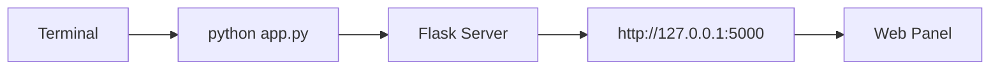

# Setup Guide

Complete guide for installing and running the Card Balance Checker system.

## Table of Contents

- [Prerequisites](#prerequisites)
- [Quick Start with UV](#quick-start-with-uv)
- [Manual Installation](#manual-installation)
- [Configuration](#configuration)
- [Running the Application](#running-the-application)
- [Phone Automation Setup](#phone-automation-setup)
- [Troubleshooting](#troubleshooting)

---

## Prerequisites

### System Requirements

- **OS**: Linux (tested on Arch Linux/CachyOS), macOS, or Windows
- **Python**: 3.10 or higher
- **RAM**: 4GB minimum (8GB recommended)
- **Browser**: Chromium/Chrome installed (for stealth mode)

### Required Software

```bash
# Arch Linux / CachyOS
sudo pacman -S python python-pip chromium google-chrome adb scrcpy

# Ubuntu / Debian
sudo apt install python3 python3-pip chromium-browser google-chrome-stable adb scrcpy

# macOS (with Homebrew)
brew install python chromium adb scrcpy
```

---

## Quick Start with UV

**UV** is the recommended way to run this project - it's fast and handles dependencies automatically.

### 1. Install UV

```bash
# Linux/macOS
curl -LsSf https://astral.sh/uv/install.sh | sh

# Or with pip
pip install uv
```

### 2. Run the Application

```bash
# Clone or navigate to project
cd /path/to/cursor

# Run with UV (auto-installs dependencies)
uv run app.py

# Or for phone automation
uv run phone/web_app.py
```

**That's it!** UV will create a virtual environment, install all dependencies, and run the app.

### Common UV Commands

```bash
# Run main web app
uv run app.py

# Run phone automation web app
uv run phone/web_app.py

# Run with specific Python version
uv run --python 3.11 app.py

# Add a new dependency
uv add requests

# Sync dependencies
uv sync

# Create lock file
uv lock
```

---

## Manual Installation

If you prefer not to use UV:

### 1. Create Virtual Environment

```bash
cd /path/to/cursor

# Create venv
python -m venv venv

# Activate
source venv/bin/activate  # Linux/macOS
# or
.\venv\Scripts\activate   # Windows
```

### 2. Install Dependencies

```bash
pip install -r requirements.txt
```

### 3. Install Playwright Browsers

```bash
playwright install chromium
playwright install-deps  # System dependencies (Linux)
```

### 4. Install SeleniumBase (for Stealth Mode)

```bash
# Already in requirements.txt, but you can verify:
pip install seleniumbase undetected-chromedriver
```

---

## Configuration

### 1. Environment File (Optional)

```bash
cp .env.example .env
nano .env
```

### 2. Settings File

The main configuration is in `settings.json`. Edit via the web UI or manually:

```json
{
  "headless": false,
  "browser": "stealth",
  "max_retries": 5,
  "skip_duplicates": true,
  "skip_checked": true,
  "timeout": 60000,
  "captcha_mode": "gemini",
  "always_use_exit_node": true,
  "disconnect_after_task": true,
  "gemini_api_keys": [
    "YOUR_GEMINI_API_KEY_1",
    "YOUR_GEMINI_API_KEY_2"
  ],
  "gemini_model": "gemini-2.5-flash",
  "gemini_prompt_preset": "expert"
}
```

### 3. Google Sheets Setup (Required for Sheet Features)

1. Go to [Google Cloud Console](https://console.cloud.google.com/)
2. Create a new project
3. Enable Google Sheets API
4. Create Service Account credentials
5. Download JSON credentials as `credentials.json`
6. Share your Google Sheet with the service account email

```bash
# Place credentials file
cp /path/to/downloaded/credentials.json /home/rez/cursor/credentials.json
```

### 4. Gemini API Key

1. Go to [Google AI Studio](https://aistudio.google.com/)
2. Create API key
3. Add to `settings.json` or via web UI

### 5. Tailscale Setup (Optional - for Exit Nodes)

```bash
# Install Tailscale
curl -fsSL https://tailscale.com/install.sh | sh

# Login
sudo tailscale up

# Enable exit node usage
sudo tailscale set --exit-node-allow-lan-access
```

---

## Running the Application

### Main Web Panel

```bash
# With UV (recommended)
uv run app.py

# Or manually
python app.py
```

Open browser: **http://127.0.0.1:5000**



### Phone Automation Web App

```bash
# With UV
uv run phone/web_app.py

# Or manually
python phone/web_app.py
```

Open browser: **http://127.0.0.1:5001**

### CLI Phone Automation

```bash
# Demo mode
python phone/main.py --demo

# Open specific URL
python phone/main.py --url "https://example.com"

# Without scrcpy window
python phone/main.py --no-scrcpy --url "https://example.com"
```

---

## Phone Automation Setup

### 1. Enable USB Debugging on Phone

1. Go to Settings > About Phone
2. Tap "Build Number" 7 times
3. Go back to Settings > Developer Options
4. Enable "USB Debugging"

### 2. Connect Phone

```bash
# Check connection
adb devices

# Should show:
# List of devices attached
# ABC123DEF456    device
```

### 3. Install scrcpy (Optional but Recommended)

```bash
# Arch Linux
sudo pacman -S scrcpy

# Ubuntu
sudo apt install scrcpy

# Test
scrcpy
```

### 4. Run Phone Web App

```bash
uv run phone/web_app.py
```

Open **http://127.0.0.1:5001** for phone control panel.

---

## Troubleshooting

### Browser Won't Start

```bash
# Kill existing processes
pkill -9 -f chromedriver
pkill -9 -f chromium
pkill -9 -f chrome

# Reinstall Playwright browsers
playwright install chromium --force
```

### SeleniumBase/UC Mode Issues

```bash
# Update SeleniumBase
pip install --upgrade seleniumbase

# Clear UC cache
rm -rf ~/.seleniumbase/uc_driver/

# Test UC mode
python -c "from seleniumbase import Driver; d = Driver(uc=True); d.get('https://example.com'); d.quit()"
```

### Google Sheets Connection Failed

1. Verify `credentials.json` exists
2. Check service account email has access to sheet
3. Verify sheet URL in `sheets_manager.py`

```bash
# Test connection
python -c "from sheets_manager import test_connection; test_connection()"
```

### CAPTCHA Not Solving

1. Check Gemini API key is valid
2. Try rotating to different prompt preset
3. Verify screenshot is being captured
4. Check `gemini_debug_save: true` to save debug images

### Phone Not Detected

```bash
# Restart ADB server
adb kill-server
adb start-server
adb devices

# Check USB cable and try different port
```

### Port Already in Use

```bash
# Find and kill process using port 5000
lsof -i :5000
kill -9 <PID>

# Or use different port
python app.py --port 5001
```

---

## Development Mode

For development with auto-reload:

```bash
# Flask debug mode
FLASK_DEBUG=1 uv run app.py

# Or
python app.py  # debug=True is already set in app.py
```

---

## Production Deployment

For production use:

```bash
# Install gunicorn
uv add gunicorn

# Run with gunicorn
uv run gunicorn -w 4 -b 0.0.0.0:5000 app:app

# Or with uvicorn (if using async)
uv add uvicorn
uv run uvicorn app:app --host 0.0.0.0 --port 5000 --workers 4
```

---

## Docker (Alternative)

```dockerfile
FROM python:3.11-slim

WORKDIR /app

# Install Chrome
RUN apt-get update && apt-get install -y chromium chromium-driver

# Install dependencies
COPY requirements.txt .
RUN pip install -r requirements.txt
RUN playwright install chromium

# Copy app
COPY . .

EXPOSE 5000

CMD ["python", "app.py"]
```

```bash
docker build -t card-checker .
docker run -p 5000:5000 card-checker
```

---

## Next Steps

- [ARCHITECTURE.md](./ARCHITECTURE.md) - Understand the system design
- [API_REFERENCE.md](./API_REFERENCE.md) - API endpoint documentation
- [DEVELOPMENT_JOURNEY.md](./DEVELOPMENT_JOURNEY.md) - Lessons learned
